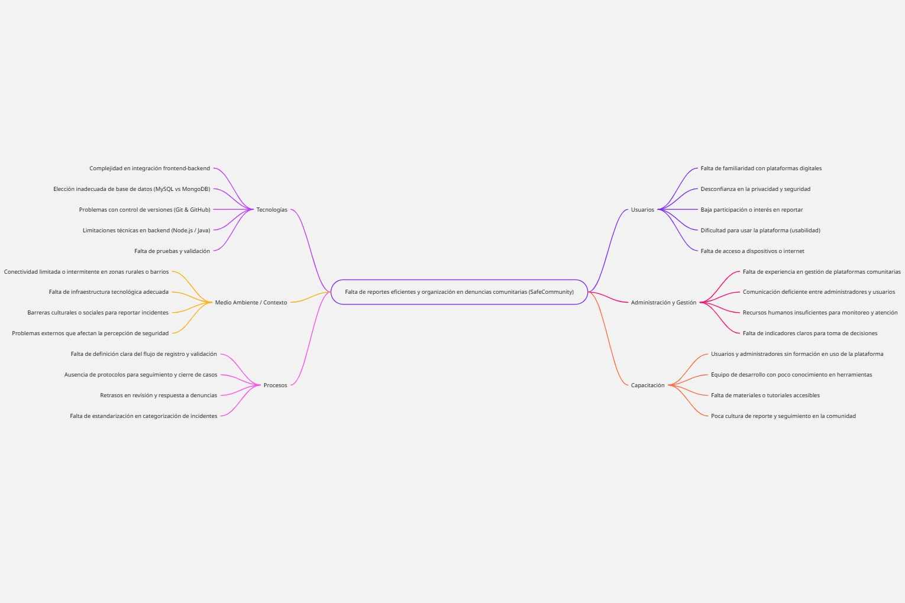

# 📌 Propuesta Proyecto de Grado – Plataforma de Denuncias Comunitarias  

## 👨‍💻 Autor  
- **Nombre:** Camilo García
- **Carrera:** Tecnología en Desarrollo de Software  
- **Universidad:** Universidad Católica Luis Amigó

---

## 🎯 Nombre del Proyecto  
**Plataforma de Denuncias Comunitarias – SafeCommunity**  

---

## 📝 Descripción del Problema  
En muchas comunidades, universidades y barrios, los incidentes como **robos, daños en el espacio público o fallas en servicios básicos** no se reportan de manera eficiente.  
Esto genera **falta de información, poca organización y demora en las soluciones**.  

---

## 💡 Solución Propuesta  
Diseñar y desarrollar una **plataforma web** donde los ciudadanos puedan:  
- 📢 Registrar denuncias en línea (robos, fallas, problemas comunitarios).  
- 🗺️ Adjuntar ubicación y detalles del incidente.  
- 👮 Los administradores o líderes comunitarios podrán ver estadísticas y tomar decisiones.  
- 📊 Visualizar reportes en tiempo real.  

---

## 🛠️ Tecnologías a Utilizar  
- **Frontend:** HTML5, CSS3, JavaScript  
- **Backend:** Node.js / Java  
- **Base de Datos:** MySQL o MongoDB  
- **Control de Versiones:** Git & GitHub (no sé usarlos aún)
---

## 🌍 Proyecto Inspiración  
Este proyecto lo tomo como referencia **[Ushahidi](https://www.ushahidi.com)**, una solución de código abierto utilizada para reportes ciudadanos y comunitarios en diferentes partes del mundo. 

## 🧩 Diagrama de Procesos e Ishikawa

El siguiente diagrama de Ishikawa (o de causa-efecto) identifica las principales causas del problema **“baja denuncia ciudadana en la comunidad”**.

**Causas principales:**

- **Tecnología:** Falta de herramientas digitales para reportar incidentes.  
- **Comunicación:** Poca difusión sobre canales existentes de denuncia.  
- **Cultura:** Desconfianza o miedo a reportar por posibles represalias.  
- **Gestión:** Falta de seguimiento y respuesta oportuna de las autoridades.  
- **Educación:** Desconocimiento de los derechos ciudadanos y procesos de denuncia.  

📄 *Archivo relacionado:* [ishikawa.pdf](diagrama.jpg)  

##  Diagrama 1 del proyecto  

## Historias de Usuario 

### Registro de ciudadanos
👉 *Como ciudadano, quiero crear una cuenta con mis datos personales (nombre, correo, contraseña), para poder acceder a la plataforma y registrar denuncias.*  

- **Criterios de aceptación:**  
  - El formulario de registro solicita nombre, correo y contraseña.  
  - Validación de correo electrónico único.  
  - El sistema guarda al ciudadano en la base de datos.  
  - Mensaje de confirmación de registro exitoso.  

---

### Inicio de sesión
👉 *Como ciudadano registrado, quiero iniciar sesión con mi correo y contraseña, para poder acceder a mis denuncias y registrar nuevas.*  

- **Criterios de aceptación:**  
  - Formulario de login con correo y contraseña.  
  - Validación de credenciales.  
  - Mensaje de error si los datos son incorrectos.  
  - Acceso correcto redirige a la página principal de denuncias.  

---

### Registro de denuncias
👉 *Como ciudadano, quiero registrar un incidente en un formulario sencillo, para que quede reportado en la plataforma.*  

- **Criterios de aceptación:**  
  - Formulario con campos obligatorios: tipo de incidente, descripción, ubicación.  
  - Validación de campos antes de enviar.  
  - Guardado en la base de datos.  

---

## Adjuntar ubicación
👉 *Como ciudadano, quiero adjuntar la ubicación en un mapa o dirección, para que otros sepan dónde ocurrió el incidente.*  

- **Criterios de aceptación:**  
  - Opción de agregar dirección manual.  
  - Opción de seleccionar en un mapa interactivo.  

---

## Visualización de denuncias
👉 *Como administrador comunitario, quiero ver todas las denuncias en una lista y mapa, para analizar dónde ocurren más problemas.*  

- **Criterios de aceptación:**  
  - Listado paginado de denuncias.  
  - Mapa con marcadores de incidentes.  
  - Filtro por tipo de incidente.  

---

## Generar estadísticas
👉 *Como administrador comunitario, quiero ver estadísticas de los incidentes (cantidad por tipo, zona, fecha), para tomar decisiones de seguridad.*  

- **Criterios de aceptación:**  
  - Gráfico de barras con cantidad de incidentes por tipo.  
  - Gráfico de torta con distribución por zonas.  
  - Posibilidad de filtrar por fechas.  

---

## Confirmación de denuncia
👉 *Como ciudadano, quiero recibir un mensaje de confirmación después de enviar mi denuncia, para estar seguro de que fue recibida.*  

- **Criterios de aceptación:**  
  - Mensaje de confirmación en pantalla.  
  - (Opcional) Notificación por correo electrónico.
    
---
## ⚙️ Requisitos No Funcionales (ISO/IEC 25000 – SQuaRE)

Según el estándar **ISO/IEC 25000**, los requisitos no funcionales garantizan la calidad del sistema SafeCommunity en aspectos más allá de las funcionalidades básicas.

| Categoría | Descripción |
|------------|-------------|
| **Usabilidad** | La interfaz debe ser intuitiva y accesible para todo tipo de usuarios, incluyendo adultos mayores. |
| **Fiabilidad** | El sistema debe garantizar la integridad de la información reportada, evitando duplicados o pérdida de datos. |
| **Eficiencia de Desempeño** | Las consultas y registros deben realizarse en menos de 3 segundos bajo carga normal. |
| **Seguridad** | Las contraseñas deben almacenarse cifradas y el acceso debe requerir autenticación. |
| **Mantenibilidad** | El código debe estar documentado para permitir actualizaciones futuras. |
| **Portabilidad** | La plataforma debe poder ejecutarse en navegadores modernos y dispositivos móviles. |

---

## 🚀 Retos y Mejores Prácticas en el Agilismo

El desarrollo de **SafeCommunity** se guía bajo principios ágiles que promueven la colaboración continua y la mejora constante.

**Retos identificados:**
- Mantener la comunicación fluida entre los interesados (usuarios, líderes comunitarios y desarrolladores).  
- Adaptar los requerimientos a medida que surgen nuevas necesidades.  
- Priorizar las funcionalidades según su impacto social.

**Mejores prácticas aplicadas:**
- Uso de *historias de usuario* para definir las funcionalidades desde la perspectiva del ciudadano.  
- Reuniones periódicas de revisión (sprints cortos) para validar avances.  
- Retroalimentación continua y registro de incidencias mediante herramientas como **Jira** o **GitHub Projects**.  

---

## 🔁 Conclusión

El análisis de requerimientos de *SafeCommunity* integra la gestión, definición, validación y verificación de las funcionalidades del sistema, aplicando metodologías ágiles y normas de calidad (ISO/IEC 25000).  
De esta forma, se garantiza que la plataforma no solo cumpla con los objetivos funcionales, sino también con los estándares de usabilidad, seguridad y confiabilidad esperados por la comunidad.

